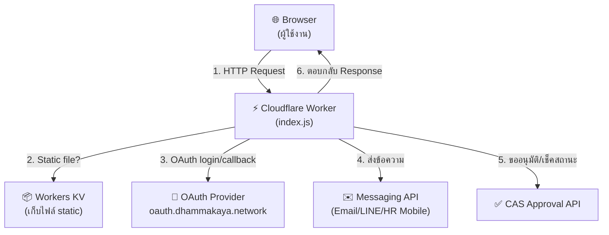
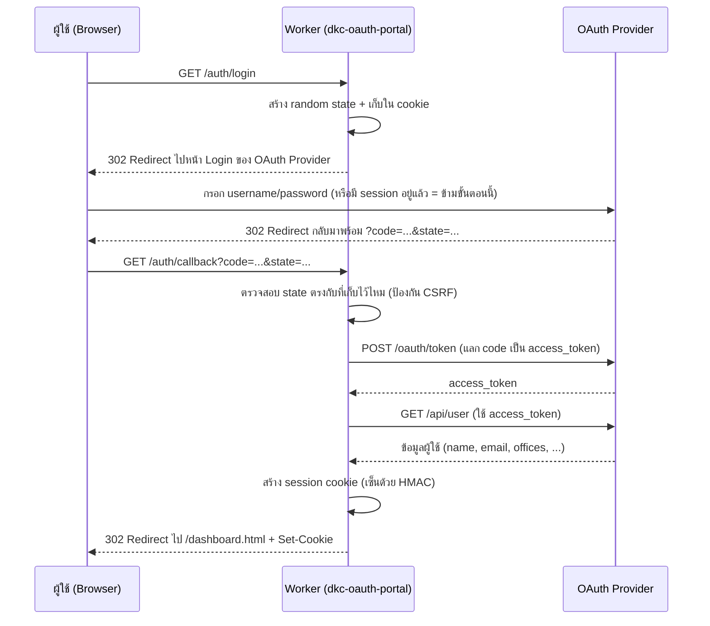
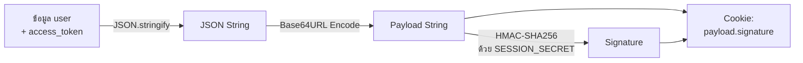
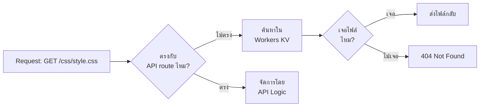
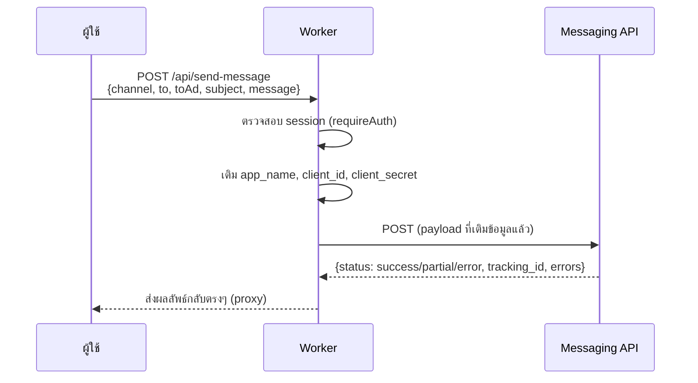
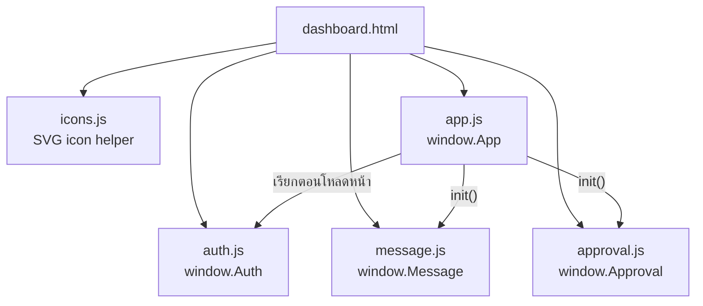

# DKC OAuth Portal

ระบบพอร์ทัลกลางสำหรับเข้าสู่ระบบผ่าน OAuth2, ส่งข้อความแจ้งเตือน (Email / LINE / HR Mobile) และระบบขออนุมัติ (CAS) ขององค์กร รันบน **Cloudflare Workers**

---

## สารบัญ

- [Tech Stack](#tech-stack)
- [ภาพรวมสถาปัตยกรรม](#ภาพรวมสถาปัตยกรรม)
- [โครงสร้างโปรเจกต์](#โครงสร้างโปรเจกต์)
- [OAuth Login Flow](#oauth-login-flow)
- [ระบบ Session](#ระบบ-session)
- [Static File Serving](#static-file-serving)
- [API Endpoints](#api-endpoints)
- [Frontend Modules](#frontend-modules)
- [Environment Variables](#environment-variables)
- [วิธีรันโปรเจกต์](#วิธีรันโปรเจกต์)
- [Deploy](#deploy)

---

## Tech Stack

| ส่วน | เทคโนโลยี |
|---|---|
| Runtime | Cloudflare Workers (Edge JavaScript runtime, ไม่ใช่ Node.js) |
| Tooling / CLI | Wrangler v3 |
| Local simulation | Miniflare (จำลอง Workers runtime ในเครื่อง) |
| Static hosting | Workers Sites (`[site]` binding → เก็บไฟล์ static ใน KV) |
| Backend language | Vanilla JavaScript (ES Modules) — ไม่มี framework |
| Frontend | HTML + CSS + Vanilla JavaScript (ไม่มี framework เช่น React/Vue) |
| Auth | OAuth 2.0 Authorization Code Flow (custom provider: `oauth.dhammakaya.network`) |
| Session | Signed Cookie (HMAC-SHA256) — ไม่ใช้ฐานข้อมูลหรือ KV เก็บ session |
| External services | OAuth Provider API, Email/LINE/HR Mobile Messaging API, CAS Approval API |

> **หมายเหตุ**: โปรเจกต์นี้ไม่มีฐานข้อมูลของตัวเอง (no database) ทุกอย่างพึ่งพา API ภายนอก (`OAUTH_BASE_URI`) เป็นแหล่งข้อมูลจริง (source of truth) ทั้งเรื่อง user, การส่งข้อความ, และการอนุมัติ

---

## ภาพรวมสถาปัตยกรรม

Worker ตัวเดียว (`worker/index.js`) ทำหน้าที่ 2 อย่างพร้อมกัน:

1. **API/Backend** — จัดการ OAuth, session, และ proxy ไปยัง API ภายนอก
2. **Static File Server** — เสิร์ฟไฟล์ HTML/CSS/JS จากโฟลเดอร์ `public/`



**หลักการทำงาน**: ทุก request ที่เข้ามาที่ Worker จะถูกตรวจสอบ `path` และ `method` ทีละเงื่อนไข (`if` แบบ sequential) — ถ้าตรงกับ route ที่รู้จัก (`/auth/login`, `/api/send-message` ฯลฯ) ก็จัดการตามนั้น ถ้าไม่ตรงกับ route ไหนเลย จะ fallback ไปเสิร์ฟเป็นไฟล์ static แทน (ข้อ 9 ในโค้ด)

---

## โครงสร้างโปรเจกต์

```
dkc-oauth-portal/
├── package.json          # scripts: dev, deploy (เรียก wrangler ใน worker/)
├── public/                # ไฟล์หน้าเว็บ (Static Site) — deploy ขึ้น KV
│   ├── index.html         # หน้า Login
│   ├── dashboard.html     # หน้าหลักหลัง Login
│   ├── css/style.css
│   ├── icons/icons.js
│   └── js/
│       ├── app.js         # ควบคุมภาพรวมหน้า dashboard (navigation, toast)
│       ├── auth.js         # เรียก /auth/me, /auth/login, /auth/logout
│       ├── message.js      # ฟอร์มส่งข้อความ → /api/send-message
│       └── approval.js     # ฟอร์มขออนุมัติ → /api/cas/*
└── worker/
    ├── index.js           # Worker หลัก — routing + business logic ทั้งหมด
    ├── package.json
    └── wrangler.toml      # ค่า config: env vars, site bucket, port
```

**สำคัญ**: `public/` กับ `worker/` เป็นคนละส่วนกัน — `public/` คือ "หน้าตา" (frontend) ส่วน `worker/index.js` คือ "สมอง" (backend) ทั้งสองส่วนถูก deploy ไปด้วยกันเป็น Worker ตัวเดียว โดย `public/` ถูกฝังเข้า KV ผ่านการตั้งค่า `[site] bucket = "../public"` ใน `wrangler.toml`

---

## OAuth Login Flow

ใช้มาตรฐาน **OAuth 2.0 Authorization Code Flow** ทำงานเป็น 4 ขั้นตอนหลัก:



### ทำไมต้องมี `state`?

`state` คือค่าสุ่มที่สร้างตอนกด Login แล้วฝังไว้ทั้งใน cookie และใน URL ที่ส่งไป OAuth Provider เมื่อ Provider ส่งกลับมาที่ `/auth/callback` เราจะเทียบ `state` ในคุกกี้กับ `state` ใน URL — ถ้าไม่ตรงกัน แปลว่า request นี้อาจถูกปลอมแปลง (CSRF attack) จึงต้องปฏิเสธทันที

---

## ระบบ Session

โปรเจกต์นี้ **ไม่ใช้ session store แบบ database/KV** แต่ใช้เทคนิค **Stateless Signed Cookie** แทน



**ตอนอ่าน session กลับ** (`readSession`) จะทำย้อนกลับ:
1. แยก cookie เป็น `payload` และ `signature`
2. คำนวณ signature ใหม่จาก `payload` ด้วย secret เดิม
3. เทียบกับ signature ที่แนบมา — ถ้าไม่ตรงกัน แปลว่า cookie ถูกแก้ไข/ปลอมแปลง → ปฏิเสธ
4. ถ้าตรงกัน → decode payload กลับเป็น JSON (ใช้ UTF-8 decode เพื่อรองรับภาษาไทย)

**ข้อดี**: ไม่ต้องมีฐานข้อมูลเก็บ session, เร็ว, scale ง่ายเพราะ Worker ไหนก็ตรวจสอบได้โดยไม่ต้องคุยกับที่เก็บกลาง
**ข้อเสีย**: revoke session รายตัวไม่ได้ทันที (ต้องรอ cookie หมดอายุ หรือเปลี่ยน `SESSION_SECRET` ทั้งระบบ)

---

## Static File Serving

หน้าเว็บ (`public/*.html`, `*.css`, `*.js`) ไม่ได้ถูกเสิร์ฟจากเซิร์ฟเวอร์ไฟล์ทั่วไป แต่ใช้กลไก **Workers Sites**:

1. ตอน deploy, Wrangler จะอัปโหลดทุกไฟล์ใน `public/` เข้า **Workers KV** (key-value store แบบ edge)
2. เมื่อมี request ที่ไม่ตรงกับ API route ใดๆ เลย โค้ดจะเรียก `getAssetFromKV()` จากไลบรารี `@cloudflare/kv-asset-handler`
3. ฟังก์ชันนี้จะจับคู่ `path` ของ request กับไฟล์ที่ตรงกันใน KV แล้วส่งกลับเป็น Response



---

## API Endpoints

ทุก endpoint อยู่ใน `worker/index.js` ตรวจสอบด้วย `if (path === ... && method === ...)` ทีละอัน:

| Method | Path | คำอธิบาย | ต้อง Login? |
|---|---|---|---|
| GET | `/auth/login` | เริ่ม OAuth flow, redirect ไป Provider | ❌ |
| GET | `/auth/callback` | รับ code กลับจาก Provider, แลก token, สร้าง session | ❌ |
| GET | `/auth/me` | คืนข้อมูล user จาก session ปัจจุบัน | ✅ |
| GET | `/auth/logout` | ล้าง session cookie, redirect ไป logout ของ Provider | ❌ |
| POST | `/api/send-message` | ส่งข้อความผ่าน Email/LINE/HR Mobile (proxy ไป Messaging API) | ✅ |
| POST | `/api/cas/request` | ส่งคำขออนุมัติ (proxy ไป CAS API) | ✅ |
| POST | `/api/cas/status` | เช็คสถานะคำขออนุมัติ | ✅ |
| GET | `/api/cas/callback` | Endpoint ที่ CAS API เรียกกลับมาแจ้งผลอนุมัติ, แสดงหน้า HTML สรุปผล | ❌ (เรียกจากระบบภายนอก) |
| * | (อื่นๆ) | Fallback ไปเสิร์ฟไฟล์ static จาก `public/` | ขึ้นกับหน้า |

### ตัวอย่าง: `/api/send-message`



Worker ทำหน้าที่เป็น **proxy/gateway** ที่คอยเติม credential ลับ (`client_secret`) ก่อนส่งต่อ เพื่อไม่ให้ฝั่ง frontend (browser) รู้ความลับนี้โดยตรง

---

## Frontend Modules

หน้า `dashboard.html` โหลด JS หลายไฟล์เรียงกัน แต่ละไฟล์รับผิดชอบคนละส่วน (module pattern แบบ global object):



| ไฟล์ | หน้าที่ |
|---|---|
| `app.js` | จุดเริ่มต้นของหน้า dashboard: เช็ค session, แสดงชื่อ/ข้อมูลผู้ใช้, จัดการ navigation ระหว่าง section, toast notification |
| `auth.js` | ฟังก์ชันเรียก `/auth/me`, `/auth/login`, `/auth/logout` — ใช้ร่วมกันทั้งหน้า index และ dashboard |
| `message.js` | จัดการฟอร์ม "ส่งข้อความ" — validate ข้อมูล, ยิงไป `/api/send-message`, แสดงผลลัพธ์ |
| `approval.js` | จัดการฟอร์ม "ขออนุมัติ" และ "ตรวจสอบสถานะ" — ยิงไป `/api/cas/request` และ `/api/cas/status` |

**หลักการสำคัญ**: แต่ละไฟล์ต้องใช้ `id`/`name` ของ HTML element **ตรงกันเป๊ะ** กับที่เขียนไว้ใน `dashboard.html` (เช่น `messageForm`, `recipients`, `msgSubject`) เพราะ JS หา element ด้วย `document.getElementById()` — ถ้าไม่ตรงกัน ฟังก์ชันจะ silent fail (ไม่มี error แต่ไม่ทำงาน)

---

## Environment Variables

กำหนดใน `worker/wrangler.toml` (`[vars]`) และ secrets (ผ่าน `wrangler secret put`):

| ตัวแปร | ประเภท | คำอธิบาย |
|---|---|---|
| `OAUTH_BASE_URI` | var | URL ของ OAuth Provider (ใช้ทั้ง login, token, user info, ส่งข้อความ, CAS) |
| `OAUTH_CLIENT_ID` | var | Client ID ที่ลงทะเบียนไว้กับ OAuth Provider |
| `OAUTH_REDIRECT_URI` | var | URL ที่ Provider จะ redirect กลับมาหลัง login สำเร็จ |
| `APP_URL` | var | URL ฐานของแอปตัวเอง (ใช้สร้างลิงก์ redirect/callback) |
| `MSG_APP_NAME` | var | ชื่อแอปที่ต้องแนบไปกับ request ส่งข้อความ (`app_name`) |
| `OAUTH_CLIENT_SECRET` | secret | ความลับคู่กับ Client ID สำหรับแลก token |
| `SESSION_SECRET` | secret | ใช้เซ็น/ตรวจสอบ session cookie (HMAC) |

> Secrets ไม่เก็บใน `wrangler.toml` (เพื่อไม่ให้หลุดเข้า version control) แต่ตั้งผ่าน `wrangler secret put <ชื่อ>` หรือไฟล์ `.dev.vars` ตอนพัฒนา local

---

## วิธีรันโปรเจกต์

```bash
# ติดตั้ง dependencies (รันที่ root)
npm install

# รัน local dev server (จำลองด้วย Miniflare)
npm run dev
```

จากนั้นเปิดเบราว์เซอร์ไปที่ `http://localhost:8787` (**ใช้ `localhost` ไม่ใช่ `127.0.0.1`** เพราะ cookie ผูกกับ domain ที่ตั้งไว้ใน `OAUTH_REDIRECT_URI`)

---

## Deploy

```bash
npm run deploy
```

คำสั่งนี้จะ:
1. อัปโหลดไฟล์ `public/` ทั้งหมดขึ้น Workers KV
2. Deploy โค้ด `worker/index.js` ขึ้น Cloudflare edge network ทั่วโลก

ก่อน deploy จริง ต้องตั้งค่า secrets และ vars ให้ตรงกับ production (เช่น `OAUTH_REDIRECT_URI` และ `APP_URL` ต้องเปลี่ยนจาก `localhost` เป็นโดเมนจริง)